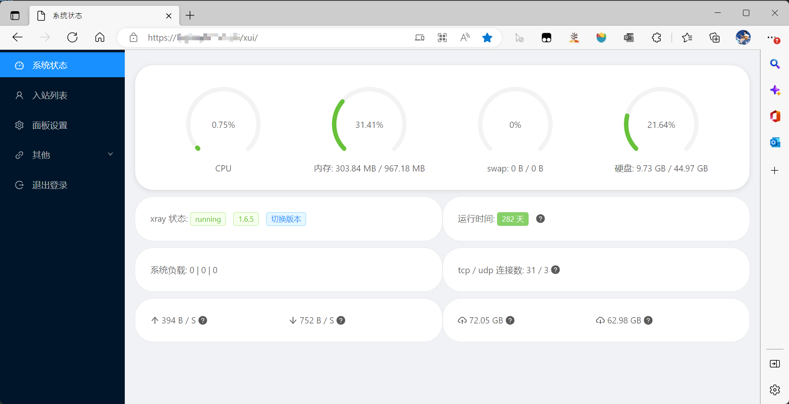

# README

## 说明
基于`docker`一键搭建`x-ui`。

- 基于[x-ui](https://github.com/vaxilu/x-ui)的[docker镜像](https://hub.docker.com/repository/docker/zai7lou/x-ui)
- 使用`nginx`作为反代服务器
- 使用`Let'sEncrypt`作为`CA`方
- 使用[acme](https://github.com/acmesh-official/acme.sh)生成管理证书

思路：下载一键安装脚本`./install.sh`, 脚本会先生成http站点，此时80端口正常工作，然后利用acme生成CA证书，完成https站点部署。

## 基础环境正常
- 请先确保服务器已安装好`docker`和`docker compose`(v2)环境。（一键安装脚本：`curl -sSL https://get.docker.com/ | sh`）
- 请确保已经拥有一个域名(如`xui.test.tk`)，且域名已DNS到服务器的ip。

## 开始

```
mkdir -p ./myxui
cd ./myxui
wget https://raw.githubusercontent.com/RayWangQvQ/Ray.Notes.Xui/main/install.sh
chmod +x ./install.sh
./install.sh --host xui.test.com --mail mail@qq.com
```

其中`xui.test.com`换成自己真实域名，`mail@qq.com`换成自己真实邮箱（乱填会导致`acme`生成证书时异常）

## 测试

访问 `http://xui.test.com` 和 `https://xui.test.com`，测试是否可访问。

xui的默认用户名和密码都是`admin`，请登录后自行在面板中修改。



## 设置节点，添加入站
在面板添加入站时，端口`50001`到`50006`可选。

tls的域名输入之前配置的域名，公钥输入`/letsencrypt/{域名}/fullchain.crt`，密钥输入`/letsencrypt/{域名}/privkey.key`，注意替换{域名}为真实域名，如`/letsencrypt/xui.test.tk/fullchain.crt`

## 关于镜像